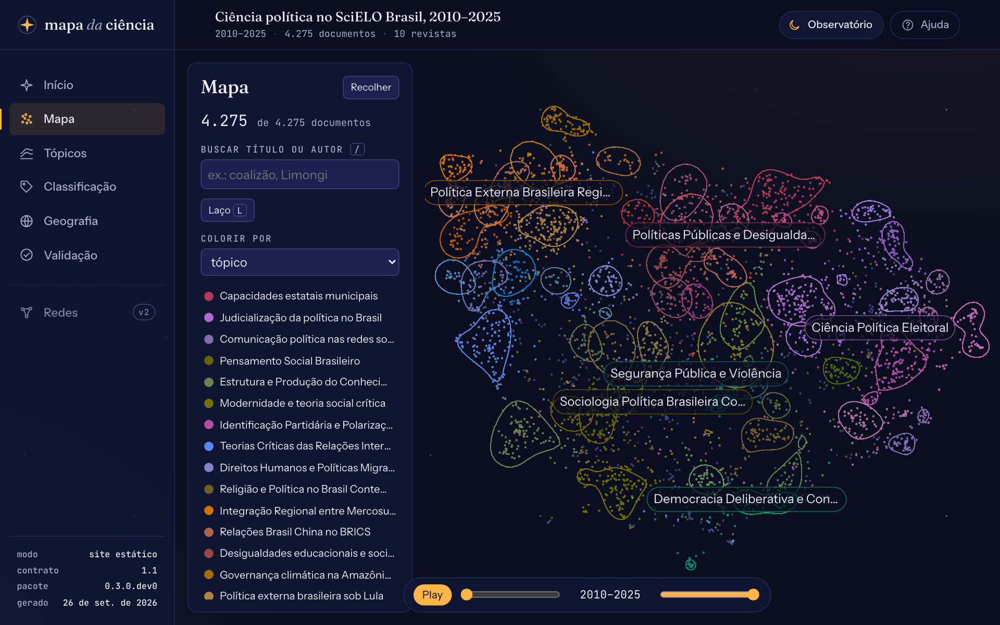

# mapa-da-ciencia

**Observatório da literatura científica com modelos de linguagem locais.** O `mapa-da-ciencia` coleta milhares de artigos, começando pelo SciELO, e mostra:

- **sobre o que se escreve**, com tópicos num mapa e a evolução deles no tempo;
- **como se pesquisa**, com a classificação de cada resumo segundo um codebook seu, com evidência textual e validação contra a sua codificação;
- **onde se produz**, com UF, país e instituição.

Os modelos rodam no seu computador, via [Ollama](https://ollama.com): nenhum texto sai da sua máquina, e não é preciso chave de API.

*In English: [see below](#in-english).*

> **Status:** versão 0.6.0, com a coleta de artigos, os tópicos num mapa navegável e no tempo, a geografia da produção e a classificação por codebook com validação (marcos M2 a M5), tudo também pela interface, com o progresso ao vivo (M6). A publicação do site e as figuras chegam no M7. Ainda não há versão no PyPI.



## Veja

- **[Demo](https://felipelamarca.com/mapa-da-ciencia/demo/)**: o piloto, com os 4.275 artigos de ciência política do SciELO Brasil de 2010 a 2025, publicado com `mapa publicar`.
- **[Oficina no Colab](https://colab.research.google.com/github/felipelmc/mapa-da-ciencia/blob/main/notebooks/oficina_colab.ipynb)**: um mapa da *Opinião Pública* do zero, numa GPU gratuita do Google, em uns 30 minutos.

## Experimente

Com o [uv](https://docs.astral.sh/uv/) instalado, o *wheel* da última [*release*](https://github.com/felipelmc/mapa-da-ciencia/releases) traz a interface pronta:

```bash
uv tool install "https://github.com/felipelmc/mapa-da-ciencia/releases/download/v0.6.0/mapa_da_ciencia-0.6.0-py3-none-any.whl"
mapa painel --exemplo
```

O painel abre no navegador com um exemplo **sintético** (dados fictícios). Para trabalhar no código, com a interface compilada a partir do fonte, veja [Explorar o exemplo em 5 minutos](https://felipelmc.github.io/mapa-da-ciencia/tutoriais/explorar-exemplo/).

Para mapear artigos de verdade, por exemplo os da *Opinião Pública* de 2010 a 2025 (os tópicos e a classificação pedem o [Ollama](https://felipelmc.github.io/mapa-da-ciencia/guias/instalacao/) com os modelos do perfil):

```bash
mapa novo projetos/op --revista op
mapa coletar -P projetos/op
mapa topicos -P projetos/op
mapa geografia -P projetos/op
mapa classificar -P projetos/op
mapa painel -P projetos/op
```

O passo a passo está em [Seu primeiro mapa](https://felipelmc.github.io/mapa-da-ciencia/tutoriais/primeiro-mapa/) (a coleta), na [parte 2](https://felipelmc.github.io/mapa-da-ciencia/tutoriais/primeiro-mapa-topicos/) (tópicos e mapa), na [parte 3](https://felipelmc.github.io/mapa-da-ciencia/tutoriais/primeiro-mapa-tempo-e-geografia/) (tempo e geografia) e na [parte 4](https://felipelmc.github.io/mapa-da-ciencia/tutoriais/primeiro-mapa-classificacao/) (classificação e validação). Sem o terminal, o mesmo percurso está em [Seu primeiro mapa pela interface](https://felipelmc.github.io/mapa-da-ciencia/tutoriais/primeiro-mapa-pela-interface/). Para publicar o seu como site estático, veja [Publicar o site](https://felipelmc.github.io/mapa-da-ciencia/guias/publicar/).

## Documentação

[felipelmc.github.io/mapa-da-ciencia](https://felipelmc.github.io/mapa-da-ciencia/) tem os tutoriais, os guias, a referência e a metodologia ([em uma página](https://felipelmc.github.io/mapa-da-ciencia/explicacoes/metodologia/), com as [limitações e vieses](https://felipelmc.github.io/mapa-da-ciencia/explicacoes/limitacoes/)). Para ler localmente, rode `uv run --group docs mkdocs serve` e abra `http://127.0.0.1:8000`.

## Sobre

Sucessor do [SciELO-Summarizer](https://github.com/felipelmc/SciELO-Summarizer), criado no SICSS Brasil 2024. Código sob licença [MIT](LICENSE). Para citar, veja [`CITATION.cff`](CITATION.cff) (o GitHub mostra a citação em *Cite this repository*). Para contribuir, veja [`CONTRIBUTING.md`](CONTRIBUTING.md).

É um projeto independente e **não oficial**: não tem vínculo com o SciELO, o OpenAlex ou o IBGE, cujos dados públicos ele usa.

## In English

`mapa-da-ciencia` ("map of science") is a literature observatory built on local language models. It collects thousands of articles, starting with SciELO (the open-access library of Latin American journals) and OpenAlex, and shows:

- **what the literature is about**: topics from embeddings (UMAP and HDBSCAN), on a navigable map and over time, with trends estimated by quasi-binomial logistic regression;
- **how research is done**: every abstract is classified against a codebook you write, and each answer quotes the passage of the abstract that supports it; agreement is measured on a stratified sample coded blind (Cohen's kappa with bootstrap intervals, PABAK, Krippendorff's alpha, McNemar between models);
- **where it is produced**: author affiliations matched to OpenAlex/ROR institutions, with fractional counting by state, country and institution.

All models run on your computer through [Ollama](https://ollama.com) (by default `qwen3-embedding:0.6b` and `qwen3.5:9b`, which fit in a 16 GB laptop), so no text leaves your machine and no API key is needed. Everything runs from the command line, from Python (`mapa_da_ciencia.api`) or from a local web panel, and a project can be published as a static site, with abstracts only under Creative Commons licenses.

The pilot maps 4,275 political science articles from ten Brazilian journals, 2010–2025 ([live demo](https://felipelamarca.com/mapa-da-ciencia/demo/)). The interface and the [documentation](https://felipelmc.github.io/mapa-da-ciencia/) are in Portuguese; the [methodology page](https://felipelmc.github.io/mapa-da-ciencia/explicacoes/metodologia/) summarizes the whole method with its parameters. To try it, install the wheel above and run `mapa painel --exemplo`, or open the [Colab workshop notebook](https://colab.research.google.com/github/felipelmc/mapa-da-ciencia/blob/main/notebooks/oficina_colab.ipynb).

MIT licensed. An independent project, not affiliated with SciELO, OpenAlex or IBGE.
