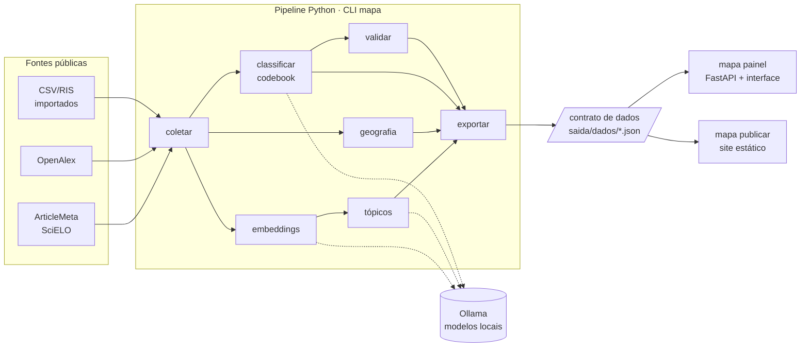

# Desenvolvimento

Como o `mapa-da-ciencia` é organizado e como contribuir. As regras de colaboração estão no [`CONTRIBUTING.md`](https://github.com/felipelmc/mapa-da-ciencia/blob/main/CONTRIBUTING.md).

## Arquitetura

O pipeline em Python produz os arquivos do **contrato de dados**, e a interface (Svelte) os lê. O painel local e o site publicado são a mesma interface lendo os mesmos arquivos. Só o painel tem a API, que permite rodar etapas e codificar.



| Parte | Onde | Papel |
|---|---|---|
| CLI | `src/mapa_da_ciencia/cli.py` | Só orquestra; a lógica fica nos módulos |
| API para notebooks | `api.py` | Fachada com as mesmas etapas da CLI, devolvendo objetos Python ([referência](../referencia/api-python.md)) |
| Configuração | `config.py`, `projeto.py` | `mapa.yaml`, `codebook.yaml` e layout da pasta do projeto |
| Reprodutibilidade | `manifesto.py` | Registro de cada execução de etapa |
| Coleta | `coleta.py`, `fontes/`, `documento.py`, `texto.py` | Orquestração da etapa (`coleta.py`); buscador com cache (`fontes/base.py`), ArticleMeta, OpenAlex, importação, deduplicação; o `Documento` normalizado |
| Tópicos | `embeddings.py`, `topicos/` | Texto de análise e embeddings com cache; kNN exato, UMAP e HDBSCAN com reatribuição do ruído; palavras-chave (c-TF-IDF), macrotemas, identidade e cores estáveis (paleta OKLCH), rótulos pelo modelo de linguagem; `topicos/pipeline.py` orquestra a etapa ([explicação](../explicacoes/topicos.md), [ADR 0007](../decisoes/0007-parametros-dos-topicos.md)) |
| Armazenamento | `armazenamento.py` | Corpus em Parquet via DuckDB, com views para consulta ([ADR 0006](../decisoes/0006-armazenamento-parquet-duckdb.md)) |
| Rede e máquina | `rede.py`, `recursos.py` | HTTP com `truststore`; memória, swap e disco |
| Modelos | `llm/` | Interface de provedor e adaptador do Ollama (embeddings, saída estruturada); guarda de memória (`memoria.py`); cache das respostas no `estado.sqlite` (`cache.py`); perfis |
| Contrato | `contrato/` | Modelos Pydantic (a fonte da verdade), exportação única de `saida/dados/` (`exportar.py`), exemplo sintético |
| Painel | `servidor/app.py` | FastAPI: interface em `/`, dados em `/dados`, API em `/api` |
| Interface | `frontend/` | SvelteKit; veja o [`frontend/README.md`](https://github.com/felipelmc/mapa-da-ciencia/blob/main/frontend/README.md) |

## Ambiente

```bash
uv sync --all-groups          # Python, dependências, ferramentas de teste e documentação
uv run pytest                 # testes
uv run ruff check             # lint
uv run ruff format            # formatação
uv run mkdocs serve           # documentação em http://127.0.0.1:8000 (o aviso do Material sobre o MkDocs 2.0 é deles)
```

A abertura do site ("Céu que se forma") é um modelo próprio do Material, `overrides/home.html`, com `docs/assets/pagina/{pagina.css,pagina.js,dados.json}`; o conteúdo antigo da página inicial está em `docs/documentacao.md`. Os testes dela rodam sobre o site montado:

```bash
uv run mkdocs build && (cd frontend && npm run e2e:pagina)
```

Os números e as histórias da abertura saem de `scripts/gerar_pagina.py`, e cada história, dos arquivos do projeto que a sustentam: os tópicos, de `topicos.json`; a geografia, de `agregados.json`; o inglês nas revistas de RI, de `dados/documentos.parquet`; a abordagem, das colunas da classificação; a validação, de `validacao.json`; a colaboração entre autores e estados, de `redes.json` e `afiliacoes.json`; o cânone, de `citacoes.json` (e o idioma das obras, de `dados/obras_citadas_openalex.parquet`). Sem o arquivo, a história some da página. Na colaboração, o gerador reconta, artigo a artigo, a série anual do `redes.json`, para ter os denominadores (a autoria conhecida e a afiliação localizada), e avisa se a recontagem não bater com ela. O cânone conta só os artigos com referências no OpenAlex, e o cartão traz a ressalva da cobertura, à vista; nenhuma história publica nomes de pessoas nem títulos de obras.

A interface precisa de Node.js 22.18 ou mais recente só para desenvolvê-la:

```bash
cd frontend
npm ci
npm run dev                   # com os dados de exemplo; veja o README do frontend
```

## Arquivos gerados a partir do código

Estes arquivos são **gerados** e versionados. O CI falha se os três primeiros estiverem desatualizados:

| O quê | Gerado por | Quando regenerar |
|---|---|---|
| `contrato/schema/*.json`, `contrato/exemplo/dados/` e `contrato/exemplo-publicado/dados/` | `uv run python scripts/gerar_contrato.py` | Ao mudar `contrato/modelos.py`, o gerador de exemplo ou as regras do `mapa publicar` |
| `frontend/src/lib/contrato/tipos.ts` | `npm run tipos` (em `frontend/`) | Depois de regenerar os schemas |
| `docs/referencia/{cli,configuracao,codebook,contrato,api-http}.md` | `uv run python scripts/gerar_referencias.py` | Ao mudar comandos, `config.py`, o contrato ou as rotas do painel |
| `docs/assets/pagina/dados.json` | `uv run python scripts/gerar_pagina.py projetos/cp-scielo` (localmente: o piloto não está no repositório) | Quando o piloto mudar: as estrelas, os números e as histórias da abertura do site |
| `notebooks/oficina_colab.ipynb` | `uv run python scripts/gerar_notebook.py` (conferido em `tests/test_notebook.py`) | Ao mudar a versão do pacote ou o roteiro da oficina |
| `src/mapa_da_ciencia/fontes/scielo-revistas.json` | `uv run python scripts/gerar_revistas.py` (1 requisição à ArticleMeta) | Para atualizar a lista de revistas do SciELO Brasil |
| `src/mapa_da_ciencia/geografia/dados/paises.csv` | `node scripts/gerar_paises.ts` (nomes do CLDR que vem no Node, sem rede) | Ao atualizar o Node; o teste confere quando a versão do CLDR é a mesma do cabeçalho do arquivo. As variantes (`variantes_paises.csv`) e as UFs (`ufs.csv`) são editadas à mão |
| `src/mapa_da_ciencia/geografia/dados/municipios.csv` | `uv run python scripts/gerar_municipios.py` (1 requisição ao IBGE) | Quando o IBGE criar municípios |
| `tests/fixtures/articlemeta/` | `uv run python scripts/recortar_fixtures.py` (precisa do cache do spike, `spikes/saida/brutos/`) | Ao precisar de novos casos de teste; os e-mails reais viram `anonimo@exemplo.invalid` |

## Convenções

- **Português** em tudo: interface, documentação, mensagens, identificadores de domínio (`coletar`, `topicos`, `revistas`).
- **Mensagens de erro dizem o que fazer**, sem traceback para o usuário (veja `_erros_amigaveis` em `cli.py`).
- **Commits pequenos**, um por tarefa modular, no formato [Conventional Commits](https://www.conventionalcommits.org/pt-br/) com escopo: `feat(coleta): …`, `docs(guias): …`. Cada commit leva o código, os testes e a documentação da tarefa, e passa no lint e nos testes.
- **Branches por marco** (`m1-esqueleto`, `m2-coleta`…), com merge em `main` e tag ao fim de cada marco.
- **Decisões técnicas relevantes viram ADR** em `docs/decisoes/`, com evidência e o script que a reproduz.

## Fazer uma release

1. Na branch do marco, o commit `chore(versao): X.Y.Z` muda a versão no `pyproject.toml`, no `CITATION.cff` (com a data), no `frontend/package.json` e no endereço do *wheel* (README, guia de instalação, tutoriais "Explorar o exemplo" e "Seu primeiro mapa" e API Python), regenera o caderno da oficina (`scripts/gerar_notebook.py`) e fecha a seção do `CHANGELOG.md`. Com o CI verde, merge `--no-ff` na `main`, tag `vX.Y.Z` e push das duas.
2. Publique a *release* no GitHub a partir da tag, com a seção do CHANGELOG como notas (`gh release create vX.Y.Z --notes-file …`). Para atualizar a demo, anexe o site do piloto como `piloto-publicado.zip` (o conteúdo da pasta gerada por `mapa publicar`, com o `index.html` na raiz do zip).
3. O workflow **Release** (`.github/workflows/release.yml`) roda sozinho: confere que a tag bate com a versão, constrói o *wheel* com a interface, confere os metadados com `twine check` (o README vira a página do PyPI, então imagens e links precisam de endereço completo), testa-o sem Node, anexa-o à *release* e roda de novo o workflow **Documentação** na `main`, que publica a demo em `/demo/` a partir da *release* mais recente.
4. **PyPI**, depois de configurado uma vez: crie o projeto `mapa-da-ciencia` no PyPI com este repositório e o workflow `release.yml` como *trusted publisher* (ambiente `pypi`), crie o ambiente `pypi` no GitHub (*Settings › Environments*) e a variável de repositório `PUBLICAR_NO_PYPI` = `true`. A partir daí, cada *release* também vai para o PyPI.
5. **Zenodo**: a integração GitHub–Zenodo está ligada desde a 1.0.1. Cada *release* publicada ganha um DOI de versão, com os metadados de `.zenodo.json` (o arquivamento leva de minutos a quase uma hora; acompanhe em *zenodo.org › GitHub*), sob o DOI de conceito [10.5281/zenodo.22998585](https://doi.org/10.5281/zenodo.22998585), que está no `CITATION.cff`, no README, na metodologia e no rodapé da abertura (lido do `CITATION.cff` por `overrides/hooks.py`). Uma *release* só vira DOI se o `.zenodo.json` for válido: a licença usa o id do vocabulário do Zenodo (`mit`).

## Marcos

| Marco | Entrega | Estado |
|---|---|---|
| M0 | Spikes: fontes, embeddings, modelo de classificação, frontend ([ADRs 0001–0005](../decisoes/README.md)) | concluído |
| M1 | Esqueleto: pacote, CLI, configuração, diagnóstico, contrato, painel, documentação, CI | concluído (v0.1.0) |
| M2 | Coleta: ArticleMeta, OpenAlex, importação, deduplicação, cache | concluído (v0.2.0) |
| M3 | Tópicos com rótulos pelo modelo de linguagem e mapa de documentos | concluído (v0.3.0) |
| M4 | Tópicos no tempo e geografia | concluído (v0.4.0) |
| M5 | Classificação por codebook e validação | concluído (v0.5.0) |
| M6 | Painel completo: rodar etapas pela interface | concluído (v0.6.0) |
| M7 | Publicação, figuras, oficina no Colab, release | concluído (v0.7.0) |
| Página | A abertura do site, "Céu que se forma" | concluído (v1.0.0) |

## Armadilhas conhecidas

**`ModuleNotFoundError: No module named 'mapa_da_ciencia'` no macOS.** O `uv` marca a pasta `.venv` como oculta no macOS, e às vezes os arquivos `.pth` da instalação editável herdam a marca. O Python 3.12+ ignora `.pth` ocultos por segurança. Para corrigir:

```bash
chflags nohidden .venv/lib/python3.*/site-packages/*.pth
```

Os testes não dependem disso (o pytest usa `pythonpath = ["src"]`).

**Typer embute o Click.** Desde a 0.27, o Typer traz a própria cópia do Click (`typer._click`). Use `typer.core.TyperGroup` e `TyperArgument` para inspecionar comandos (veja `scripts/gerar_referencias.py`).

**Não renomeie pastas geradas.** Muitos projetos ficam na Mesa ou nos Documentos, que o macOS sincroniza com o iCloud Drive. Trocar uma pasta inteira de nome (a nova entra com o nome da velha) faz o iCloud guardar a nova como "dados 2", e o projeto fica sem `saida/dados`: aconteceu com o piloto. Para pôr no lugar uma versão nova de uma pasta gerada, escreva-a numa pasta temporária ao lado e use `pastas.substituir_conteudo`, que troca os arquivos um a um e mantém a pasta.

**Cópias "arquivo 2" num repositório no iCloud Drive.** Com o próprio repositório na Mesa ou nos Documentos, o iCloud também cria cópias de arquivos que o git, o `uv` ou o build reescrevem: `test_servidor 2.py`, `index 2.md`, `workflows 2/`, até `.git/index 2`. São versões **antigas** dos arquivos, e não duplicatas: um `test_servidor 2.py` coletado pelo pytest falha com a regra de hoje. O `.gitignore` ignora esses nomes, o pytest (`collect_ignore_glob` em `tests/conftest.py`) e o MkDocs (`exclude_docs`) também, e o CI falha se algum entrar num commit. Para limpar, mova para fora do repositório os arquivos e pastas com nome terminado em espaço e número que tenham o original ao lado; o jeito definitivo é manter o repositório fora das pastas sincronizadas.
