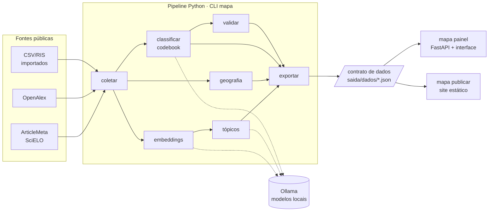

# Desenvolvimento

Como o `mapa-da-ciencia` é organizado e como contribuir. As regras de colaboração estão no [`CONTRIBUTING.md`](https://github.com/felipelmc/mapa-da-ciencia/blob/main/CONTRIBUTING.md).

## Arquitetura

O pipeline em Python produz os arquivos do **contrato de dados**, e a interface (Svelte) os lê. O painel local e o site publicado são a mesma interface lendo os mesmos arquivos. Só o painel tem a API, que permite rodar etapas e codificar.



| Parte | Onde | Papel |
|---|---|---|
| CLI | `src/mapa_da_ciencia/cli.py` | Só orquestra; a lógica fica nos módulos |
| API para notebooks | `api.py` | Fachada com as mesmas etapas da CLI, devolvendo objetos Python ([referência](../referencia/api-python.md)) |
| Configuração | `config.py`, `projeto.py` | `mapa.yaml`, `codebook.yaml` e layout da pasta do projeto |
| Reprodutibilidade | `manifesto.py` | Registro de cada execução de etapa |
| Coleta | `coleta.py`, `fontes/`, `documento.py`, `texto.py` | Orquestração da etapa (`coleta.py`); buscador com cache (`fontes/base.py`), ArticleMeta, OpenAlex, importação, deduplicação; o `Documento` normalizado |
| Tópicos | `embeddings.py`, `topicos/` | Texto de análise e embeddings com cache; kNN exato, UMAP e HDBSCAN com reatribuição do ruído; palavras-chave (c-TF-IDF), macrotemas, identidade e cores estáveis (paleta OKLCH), rótulos pelo modelo de linguagem; `topicos/pipeline.py` orquestra a etapa ([explicação](../explicacoes/topicos.md), [ADR 0007](../decisoes/0007-parametros-dos-topicos.md)) |
| Armazenamento | `armazenamento.py` | Corpus em Parquet via DuckDB, com views para consulta ([ADR 0006](../decisoes/0006-armazenamento-parquet-duckdb.md)) |
| Rede e máquina | `rede.py`, `recursos.py` | HTTP com `truststore`; memória, swap e disco |
| Modelos | `llm/` | Interface de provedor e adaptador do Ollama (embeddings, saída estruturada); guarda de memória (`memoria.py`); cache das respostas no `estado.sqlite` (`cache.py`); perfis |
| Contrato | `contrato/` | Modelos Pydantic (a fonte da verdade), exportação única de `saida/dados/` (`exportar.py`), exemplo sintético |
| Painel | `servidor/app.py` | FastAPI: interface em `/`, dados em `/dados`, API em `/api` |
| Interface | `frontend/` | SvelteKit; veja o [`frontend/README.md`](https://github.com/felipelmc/mapa-da-ciencia/blob/main/frontend/README.md) |

## Ambiente

```bash
uv sync --all-groups          # Python, dependências, ferramentas de teste e documentação
uv run pytest                 # testes
uv run ruff check             # lint
uv run ruff format            # formatação
uv run mkdocs serve           # documentação em http://127.0.0.1:8000
```

A interface precisa de Node.js 20 ou mais recente só para desenvolvê-la:

```bash
cd frontend
npm ci
npm run dev                   # com os dados de exemplo; veja o README do frontend
```

## Arquivos gerados a partir do código

Estes arquivos são **gerados** e versionados. O CI falha se os três primeiros estiverem desatualizados:

| O quê | Gerado por | Quando regenerar |
|---|---|---|
| `contrato/schema/*.json` e `contrato/exemplo/dados/` | `uv run python scripts/gerar_contrato.py` | Ao mudar `contrato/modelos.py` ou o gerador de exemplo |
| `frontend/src/lib/contrato/tipos.ts` | `npm run tipos` (em `frontend/`) | Depois de regenerar os schemas |
| `docs/referencia/{cli,configuracao,codebook,contrato}.md` | `uv run python scripts/gerar_referencias.py` | Ao mudar comandos, `config.py` ou o contrato |
| `src/mapa_da_ciencia/fontes/scielo-revistas.json` | `uv run python scripts/gerar_revistas.py` (1 requisição à ArticleMeta) | Para atualizar a lista de revistas do SciELO Brasil |
| `src/mapa_da_ciencia/geografia/dados/paises.csv` | `node scripts/gerar_paises.ts` (nomes do CLDR que vem no Node, sem rede) | Ao atualizar o Node; o teste confere quando a versão do CLDR é a mesma do cabeçalho do arquivo. As variantes (`variantes_paises.csv`) e as UFs (`ufs.csv`) são editadas à mão |
| `src/mapa_da_ciencia/geografia/dados/municipios.csv` | `uv run python scripts/gerar_municipios.py` (1 requisição ao IBGE) | Quando o IBGE criar municípios |
| `tests/fixtures/articlemeta/` | `uv run python scripts/recortar_fixtures.py` (precisa do cache do spike, `spikes/saida/brutos/`) | Ao precisar de novos casos de teste; os e-mails reais viram `anonimo@exemplo.invalid` |

## Convenções

- **Português** em tudo: interface, documentação, mensagens, identificadores de domínio (`coletar`, `topicos`, `revistas`).
- **Mensagens de erro dizem o que fazer**, sem traceback para o usuário (veja `_erros_amigaveis` em `cli.py`).
- **Commits pequenos**, um por tarefa modular, no formato [Conventional Commits](https://www.conventionalcommits.org/pt-br/) com escopo: `feat(coleta): …`, `docs(guias): …`. Cada commit leva o código, os testes e a documentação da tarefa, e passa no lint e nos testes.
- **Branches por marco** (`m1-esqueleto`, `m2-coleta`…), com merge em `main` e tag ao fim de cada marco.
- **Decisões técnicas relevantes viram ADR** em `docs/decisoes/`, com evidência e o script que a reproduz.

## Marcos

| Marco | Entrega | Estado |
|---|---|---|
| M0 | Spikes: fontes, embeddings, modelo de classificação, frontend ([ADRs 0001–0005](../decisoes/README.md)) | concluído |
| M1 | Esqueleto: pacote, CLI, configuração, diagnóstico, contrato, painel, documentação, CI | concluído (v0.1.0) |
| M2 | Coleta: ArticleMeta, OpenAlex, importação, deduplicação, cache | concluído (v0.2.0) |
| M3 | Tópicos com rótulos pelo modelo de linguagem e mapa de documentos | concluído (v0.3.0) |
| M4 | Tópicos no tempo e geografia | concluído (v0.4.0) |
| M5 | Classificação por codebook e validação | concluído (v0.5.0) |
| M6 | Painel completo: rodar etapas pela interface | concluído (v0.6.0) |
| M7 | Publicação, figuras, oficina no Colab, release | |

## Armadilhas conhecidas

**`ModuleNotFoundError: No module named 'mapa_da_ciencia'` no macOS.** O `uv` marca a pasta `.venv` como oculta no macOS, e às vezes os arquivos `.pth` da instalação editável herdam a marca. O Python 3.12+ ignora `.pth` ocultos por segurança. Para corrigir:

```bash
chflags nohidden .venv/lib/python3.*/site-packages/*.pth
```

Os testes não dependem disso (o pytest usa `pythonpath = ["src"]`).

**Typer embute o Click.** Desde a 0.27, o Typer traz a própria cópia do Click (`typer._click`). Use `typer.core.TyperGroup` e `TyperArgument` para inspecionar comandos (veja `scripts/gerar_referencias.py`).
