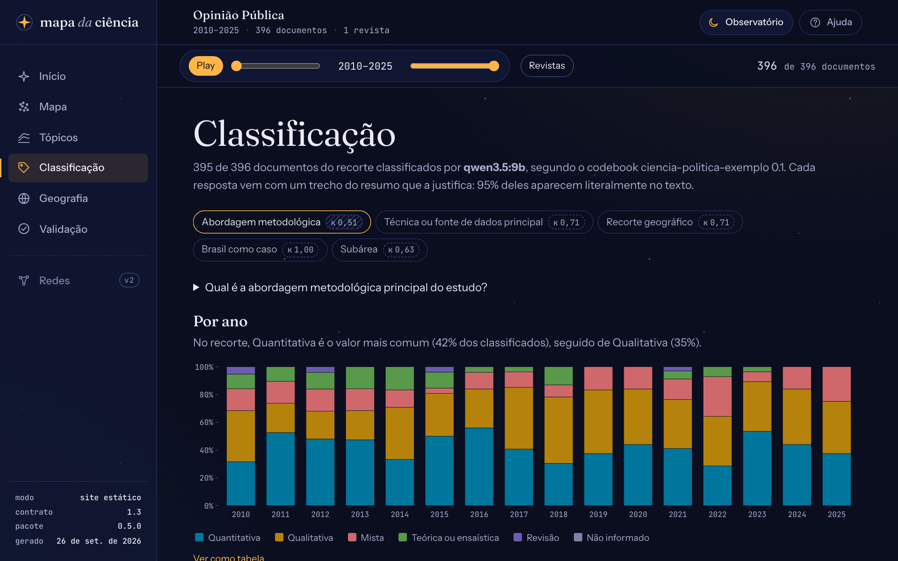
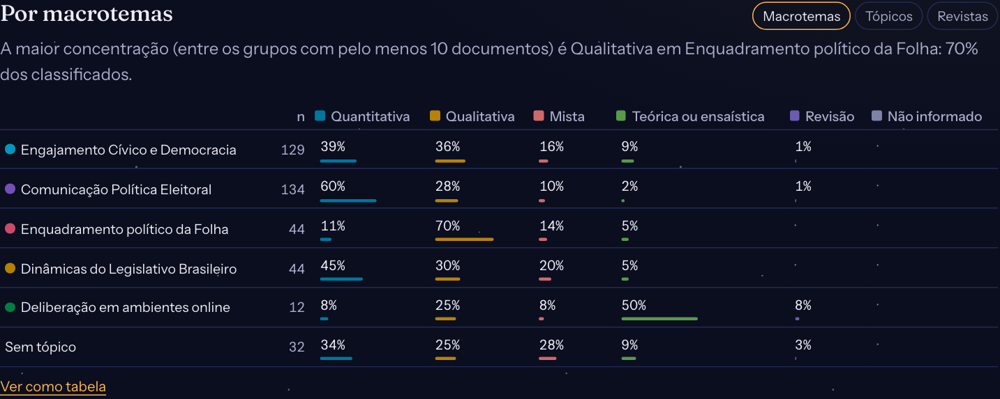

# Ler a classificação

A vista **Classificação** do painel mostra como o modelo codificou os resumos do recorte segundo o codebook, uma variável por vez, e deixa ler o trecho do resumo que sustenta cada resposta. Para gerar a classificação, veja [Classificar os resumos](classificar.md).

<figure markdown="span">
  { loading=lazy }
  <figcaption>A abordagem metodológica dos 395 artigos da <em>Opinião Pública</em> com resumo, classificados pelo <code>qwen3.5:9b</code>.</figcaption>
</figure>

## O que está na tela

- **O cabeçalho** diz quantos documentos do recorte foram classificados, por qual modelo e com qual codebook, e que parte das evidências aparece literalmente no título ou no resumo. Documentos sem resumo nunca são classificados; enquanto a etapa roda, um aviso diz quantos faltam.
- **As variáveis** do codebook, uma por botão (as de texto livre ficam de fora: a resposta de cada documento aparece nas evidências). Ao lado de cada uma, o **selo de kappa** mostra a concordância do modelo com a codificação da amostra de validação. Com hachura, o kappa está abaixo de 0,6: a distribuição daquela variável pede cuidado (veja [Ler kappa e PABAK](ler-kappa-e-pabak.md)). Com borda tracejada, a comparação é com um codificador de referência, e não com uma pessoa. A dica do selo diz contra quem, com que n e o intervalo de 95%.
- **Por ano:** em cada ano, a participação de cada valor entre os documentos classificados. O gráfico mostra o período inteiro; os anos fora do recorte ficam apagados. Os valores "não informado" aparecem em cinza.
- **Por macrotema, tópico ou revista:** a variável cruzada com os grupos do corpus, no recorte. Cada célula traz a participação do valor entre os classificados daquele grupo, com uma barra da cor do valor.

<figure markdown="span">
  { loading=lazy }
  <figcaption>A abordagem por macrotema, na <em>Opinião Pública</em>.</figcaption>
</figure>

## Ler as evidências

Escolha uma célula da tabela (ou um valor na legenda do gráfico por ano) para listar os documentos dela. Cada documento mostra o trecho que o modelo citou, marcado dentro do resumo, com um pouco de contexto:

- trecho marcado no resumo: a evidência foi encontrada no texto (literal, ou quase igual);
- "trecho não encontrado no resumo", com a borda tracejada: o modelo citou algo que não está no texto. A resposta pode estar certa, mas não está ancorada: leia o resumo;
- "sem trecho": o modelo respondeu que o resumo não informa a variável.

O título leva ao documento no mapa, com o mesmo recorte.

## Cuidados

- As proporções contam só os documentos classificados. Se a classificação estiver parcial, ou se muitos documentos de um ano não tiverem resumo, o ano pode ser pouco representativo: a tabela ("Ver como tabela") traz o número de classificados por ano.
- Um cruzamento com poucos documentos oscila muito. A frase-resumo do gráfico só considera grupos com pelo menos 10 documentos classificados.
- O modelo erra. Antes de usar os números num texto, veja a concordância na vista Validação e leia as divergências.
