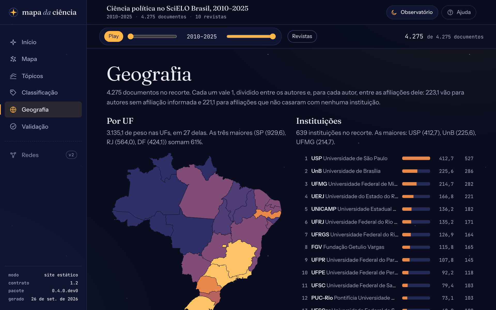
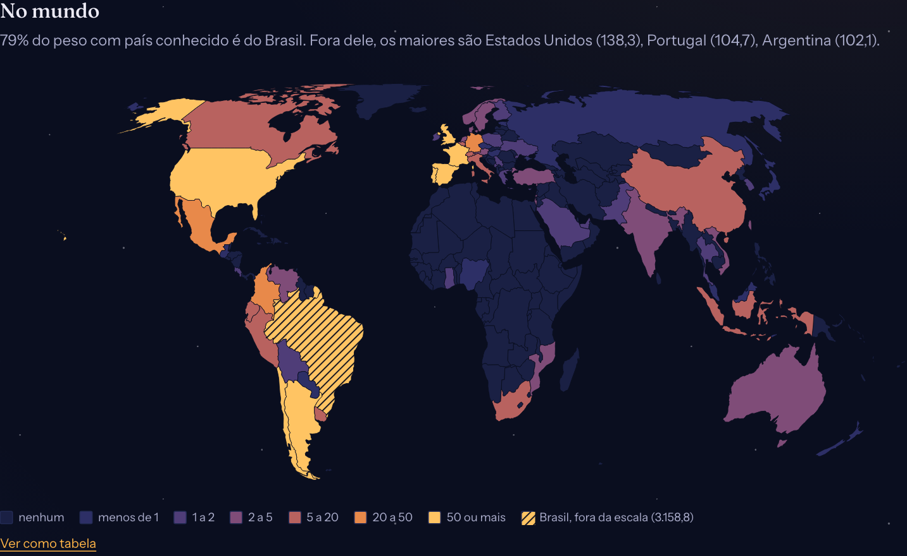
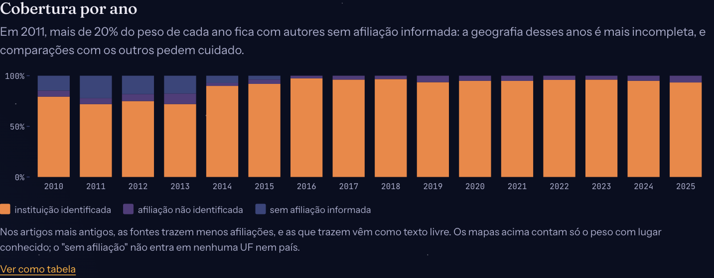

# Ler a geografia

A vista **Geografia** do painel mostra onde está a produção do corpus: por UF, por país e por instituição, com a cobertura das afiliações ano a ano. Esta página explica como ler cada gráfico e o que eles não dizem. Para gerar os dados, veja [Gerar a geografia](geografia.md); para o método, [Geografia da produção](../explicacoes/geografia.md).

<figure markdown="span">
  { loading=lazy }
  <figcaption>A vista Geografia do piloto de ciência política: São Paulo, Rio de Janeiro e o Distrito Federal concentram 61% do peso nas UFs.</figcaption>
</figure>

## O que é o "peso"

Todos os números da vista usam a **contagem fracionária**: cada documento vale 1, dividido entre os autores e, para cada autor, entre as afiliações dele. Um artigo de dois autores, um da USP e outro da UnB, dá 0,5 a cada uma. Assim, artigos com muitos autores não pesam mais que os outros.

Ao lado do peso aparece o número de **documentos** com alguma afiliação no lugar. Os dois respondem perguntas diferentes: o peso diz quanto da produção é daquele lugar; os documentos, em quantos artigos ele aparece. Uma instituição que coassina muitos artigos com outras tem mais documentos do que peso.

A frase no alto da vista diz quanto do peso não entra em nenhum lugar: autores **sem afiliação** informada, e afiliações **não identificadas**, que não casaram com nenhuma instituição (essas ainda contam no país e na UF que a fonte informou).

## As UFs

Cada UF tem a cor da sua **classe** de peso, do tom mais fraco ao mais forte. As classes crescem em escala logarítmica, com limites redondos (5, 20, 50, 100…), porque a produção é muito concentrada: no piloto, São Paulo tem mais de 350 vezes o peso do Acre. A legenda embaixo do mapa diz os limites; "nenhum" é a cor das UFs sem documentos no recorte.

A projeção preserva as áreas: a Amazônia não fica maior do que é, nem o Sul menor. Passe o mouse (ou o foco do teclado) numa UF para ver o peso e o número de documentos.

## O mundo

O mapa-múndi usa a mesma escala para os outros países. O **Brasil fica fora da escala**, hachurado: com 79% do peso com país conhecido no piloto, ele faria todos os outros países parecerem vazios. A legenda mostra o peso do Brasil à parte.

<figure markdown="span">
  { loading=lazy }
  <figcaption>Fora do Brasil, as afiliações do piloto se concentram nos Estados Unidos, em Portugal, na Argentina e no Reino Unido.</figcaption>
</figure>

## As instituições

O ranking lista as instituições do recorte da de maior peso à de menor, com a UF e o país. "Mostrar mais" acrescenta outras 20. A sigla vem do registro da instituição; o nome, em português para as instituições de países lusófonos.

Hospitais, centros e escolas de uma universidade contam para ela (o Hospital de Clínicas da Unicamp conta para a Unicamp), como faz a normalização do SciELO. Um projeto pode separar uma escola no seu `instituicoes.yaml` (veja [Gerar a geografia](geografia.md#o-arquivo-instituicoesyaml)).

## A cobertura por ano

O último gráfico mostra, de cada ano, quanto do peso tem instituição identificada, afiliação não identificada e autores sem afiliação.

<figure markdown="span">
  { loading=lazy }
  <figcaption>No piloto, os primeiros anos têm mais autores sem afiliação e mais afiliações em texto livre.</figcaption>
</figure>

A frase acima do gráfico aponta os anos em que mais de 20% do peso fica sem afiliação. Nesses anos a geografia é mais incompleta: se a participação de uma UF cresce de 2012 para 2020, parte do crescimento pode ser só a melhora das fontes.

## Filtrar por lugar

Clique numa UF, num país ou numa instituição (ou aperte ++enter++ com o foco nela) para pôr o lugar no **recorte**. O lugar aparece como um chip na barra do recorte, e vale para as outras vistas: um documento passa se tiver **alguma** afiliação no lugar escolhido.

Cada gráfico ignora o próprio filtro. Com São Paulo escolhido, o mapa das UFs continua mostrando as outras, para comparar e escolher mais; o mundo e o ranking passam a mostrar só os artigos com alguma afiliação em São Paulo, inclusive os coautores de fora do estado. É a rede de colaboração dos artigos paulistas.

Leve o recorte para o **Mapa** pelo trilho para ver sobre o que escrevem os autores de um lugar, ou para os **Tópicos** para ver como esses temas mudam no tempo.

## O que a geografia não diz

- **Onde a pesquisa foi feita.** A afiliação é onde o autor trabalhava ao publicar, e não o lugar estudado.
- **Quem é mais produtivo.** O corpus é um recorte de revistas: uma instituição com peso baixo pode publicar muito em revistas de fora dele.
- **Comparações finas entre anos antigos e recentes**, pela cobertura desigual das fontes.

"Ver como tabela", embaixo de cada gráfico, mostra os mesmos números numa tabela.
