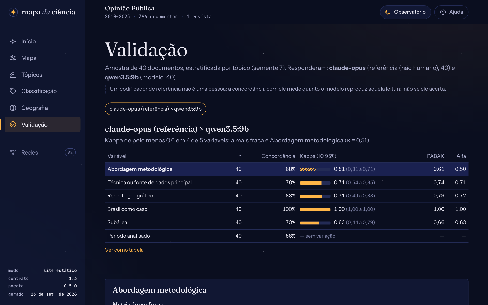
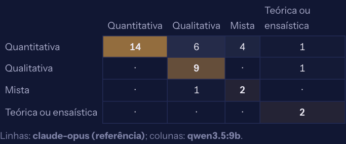

# Ler kappa e PABAK

`mapa validar metricas` compara, variável por variável, as respostas de cada par de participantes na amostra de validação: cada codificador com cada modelo, os codificadores entre si e os modelos entre si. Esta página explica o que cada número diz e o que fazer com uma variável fraca. Para montar a amostra e as codificações, veja [Codificar a amostra](codificar-a-amostra.md).

```bash
uv run mapa validar metricas
```

Cada par tem uma tabela, com uma linha por variável. O primeiro nome do par é tomado como referência na matriz de confusão e na precisão e revocação por classe.

No painel, a vista **Validação** mostra o mesmo: escolha o par no alto e uma variável na tabela para ver a matriz de confusão, a precisão e a revocação por categoria e as divergências, cada uma com o trecho que o modelo citou. No painel local, os números são calculados na hora, incluindo as codificações que acabaram de ser feitas.

<figure markdown="span">
  { loading=lazy }
  <figcaption>A validação do tutorial: 40 artigos da <em>Opinião Pública</em>, o <code>qwen3.5:9b</code> contra o codificador de referência.</figcaption>
</figure>

## Os números

| Número | O que diz | Cuidado |
|---|---|---|
| **n** | Documentos que os dois responderam | Com n pequeno, todos os outros números oscilam muito. |
| **Concordância** | Fração de respostas iguais | Uma variável em que quase tudo é "não" dá concordância alta até para quem responde sempre "não". |
| **Kappa de Cohen** | A concordância descontado o que se esperaria por acaso, dadas as frequências de cada um: 0 é o acaso, 1 é a concordância perfeita | Fica baixo quando uma categoria domina, mesmo com poucos erros (o "paradoxo do kappa"). Indefinido (—) quando os dois deram sempre a mesma resposta. |
| **IC 95%** | O intervalo do kappa por *bootstrap*: 1.000 reamostras dos documentos da amostra, com a semente do projeto | Um intervalo largo pede uma amostra maior antes de concluir. |
| **PABAK** | O kappa ajustado para prevalência e viés: supõe as categorias igualmente prováveis, `(k·concordância − 1)/(k − 1)`, com `k` categorias no codebook | Ajuda a ler o paradoxo do kappa, mas não o substitui: relate os dois. |
| **Alfa de Krippendorff** | Parecido com o kappa, mas com o acaso calculado das respostas dos dois juntos; é a medida mais usada em análise de conteúdo | Muito próximo do kappa quando os dois têm frequências parecidas. |

Nas variáveis de **múltipla escolha**, cada categoria vira uma variável sim/não (`variavel:categoria`), com seus próprios números. Nas de **texto**, só a concordância, depois de ignorar maiúsculas e espaços.

### Faixas de referência

As faixas de Landis e Koch (1977) são as mais citadas para o kappa, mas são convenções, não testes:

| Kappa | Leitura |
|---|---|
| abaixo de 0,40 | fraca |
| 0,40 a 0,60 | moderada |
| 0,60 a 0,80 | substancial |
| acima de 0,80 | quase perfeita |

Na análise de conteúdo, Krippendorff recomenda alfa ≥ 0,80 para conclusões firmes e ≥ 0,667 para conclusões provisórias. O painel marca com hachura as variáveis com kappa abaixo de 0,6.

## Matriz de confusão e P/R/F1

`mapa.validacao(p)` (na API Python) traz, para cada par e variável, a matriz de confusão (linhas: a referência; colunas: o outro) e, por categoria:

- **precisão**: das vezes em que o modelo deu esta categoria, quantas a referência também deu;
- **revocação**: das vezes em que a referência deu esta categoria, quantas o modelo encontrou;
- **F1**: a média harmônica das duas.

Uma categoria com revocação baixa é uma que o modelo não reconhece; com precisão baixa, uma que ele usa demais. A matriz mostra para onde vão os erros: duas categorias que se confundem muito talvez devam ser definidas melhor, ou fundidas.

<figure markdown="span">
  { loading=lazy }
  <figcaption>Na amostra do tutorial, o modelo leu como qualitativos ou mistos 10 dos 25 artigos que a referência leu como quantitativos.</figcaption>
</figure>

## Comparar modelos

Com dois modelos classificando a amostra (`mapa classificar --somente-amostra --modelo X`), o **teste de McNemar exato** compara os acertos dos dois contra a mesma referência. Ele conta só os documentos em que um acertou e o outro errou, e o valor-p diz se essa diferença vai além do acaso. A saída menciona só as variáveis com p < 0,05. Com muitas variáveis, alguma sai abaixo de 0,05 por acaso: leia o conjunto, não uma variável isolada.

## Codificador de referência não é uma pessoa

Um codificador importado com `--tipo referencia` (por exemplo, um modelo maior lendo a amostra às cegas) aparece como "referência, não humano". A concordância com ele diz quanto o modelo local reproduz essa leitura, não se acerta. Para afirmar que a classificação é válida, a comparação que conta é com pessoas.

## O que fazer com uma variável fraca

1. **Leia as divergências.** `mapa validar metricas` diz quantas há; a vista Concordância do painel e o relatório mostram cada uma, com a evidência que o modelo citou. Muitas vezes a divergência revela uma ambiguidade da definição, e não um erro do modelo.
2. **Reescreva a definição e os exemplos** no `codebook.yaml` (veja [Escrever um codebook](codebook.md)): diga o que fica de fora de cada categoria, acrescente um exemplo do caso que confundiu. A classificação é refeita com o codebook novo.
3. **Simplifique:** funda categorias que ninguém distingue com segurança, ou troque uma variável difícil por uma booleana.
4. **Teste um modelo maior** na amostra (`--somente-amostra --modelo`), se a memória permitir, e compare com McNemar.
5. **Relate.** Se a variável continuar fraca, use-a com cautela e publique as métricas junto com os resultados.
