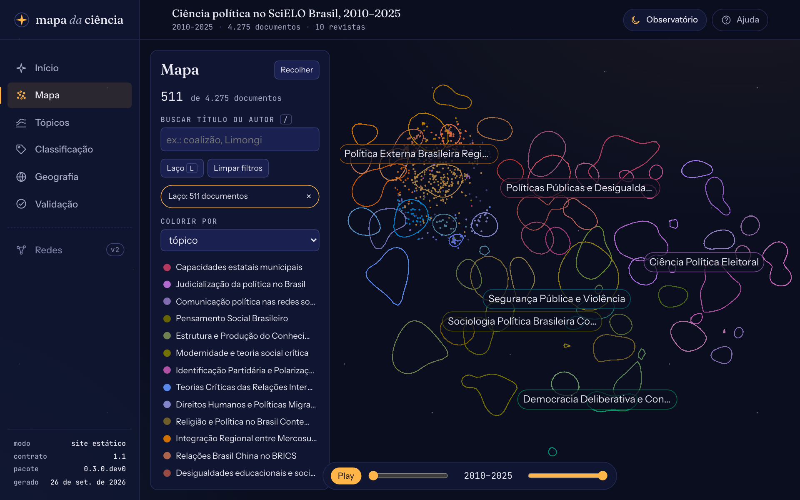
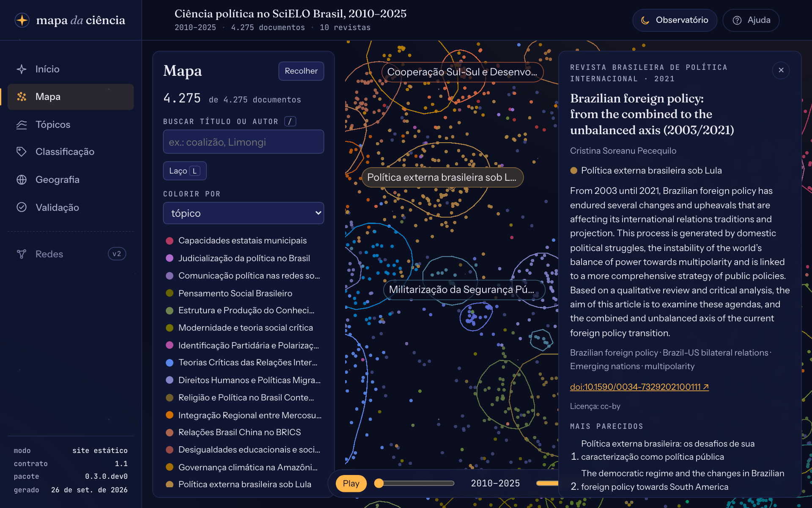

# Ler o mapa

O **Mapa** do painel mostra cada documento do corpus como um ponto. Esta página explica o que o mapa quer dizer, o que ele não quer dizer, e como usar os controles. Para saber como as posições e os tópicos são calculados, veja [Como os tópicos são construídos](../explicacoes/topicos.md).

<figure markdown="span">
  { loading=lazy }
  <figcaption>O piloto: 4.275 artigos de dez revistas de ciência política, de 2010 a 2025, coloridos por tópico. Com o zoom afastado, os rótulos são os dos macrotemas, escritos pelo modelo de linguagem local (<code>qwen3.5:9b</code>).</figcaption>
</figure>

## O que o mapa mostra

- **Cada ponto é um documento.** Pontos próximos são textos parecidos: título e resumo tratam de assuntos vizinhos.
- **As linhas fechadas são os tópicos.** Cada contorno envolve a região mais densa do núcleo de um tópico (os documentos que o agrupamento reuniu com mais certeza), deixando dentro cerca de 80% deles. Um tópico pode ter mais de um contorno, quando o núcleo se divide em duas regiões do mapa.
- **Os rótulos nomeiam as regiões.** De longe, aparecem os macrotemas (grupos de tópicos); ao aproximar, os tópicos. Clicar num rótulo mostra só aquele tópico ou macrotema.
- **A cor** segue o "Colorir por": tópico, macrotema, revista ou ano. Pontos em cinza não têm tópico.

!!! warning "O que o mapa não quer dizer"
    - **Os eixos não têm significado.** Não há "esquerda" ou "direita" temática: o mapa pode sair girado ou espelhado de uma execução para outra, com os mesmos vizinhos.
    - **Distâncias grandes são pouco confiáveis.** Dois grupos distantes não são necessariamente "mais diferentes" que dois grupos a meia distância. O que o mapa preserva é a vizinhança próxima.
    - **Um ponto sem tópico não é um erro.** São trabalhos isolados, de fronteira ou que misturam assuntos.

## Controles

| Controle | Para quê |
|---|---|
| Roda do mouse, arrastar | Aproxima e move o mapa |
| Legenda | Mostra só os documentos de um tópico, macrotema ou revista (clique de novo para desfazer) |
| **Buscar título ou autor** (<kbd>/</kbd>) | Mostra só os documentos que respondem à busca, sem diferença de acentos; clique num resultado para abrir o cartão |
| **Laço** (<kbd>L</kbd>) | Arraste em volta de uma região para ficar só com os documentos dela |
| Linha do tempo | Escolhe o intervalo de anos; o **Play** passa ano a ano |
| Limpar filtros | Volta ao corpus inteiro |
| Recolher | Esconde o painel de controles e libera o mapa |

<kbd>Esc</kbd> fecha o cartão ou desliga o laço, e <kbd>?</kbd> abre a lista de atalhos na Ajuda.

<figure markdown="span">
  { loading=lazy }
  <figcaption>Com o laço, o mapa fica só com os documentos da região desenhada; o painel mostra quantos são e permite tirar o laço.</figcaption>
</figure>

## O cartão do documento

<figure markdown="span">
  { loading=lazy }
  <figcaption>O cartão de um artigo: resumo, palavras-chave, DOI, licença e os cinco documentos mais parecidos. Com o zoom aproximado, os rótulos passam a ser dos tópicos.</figcaption>
</figure>

Clique num ponto para abrir o cartão, com a revista, o ano, os autores, o resumo, as palavras-chave, o DOI e os cinco documentos mais parecidos (clique num deles para abri-lo). O cartão também diz como o documento chegou ao tópico:

- **pela vizinhança**: o agrupamento deixou o documento de fora, mas a maioria dos seus vizinhos está naquele tópico;
- **sem tópico**: nem o agrupamento nem a vizinhança o colocaram num tópico;
- **sem resumo em inglês** ou **sem resumo**: o tópico veio de um resumo em outro idioma ou só do título.

Quando a licença do resumo não permite mostrá-lo, o cartão avisa e aponta para a página do artigo.

## Compartilhar exatamente o que está na tela

Tudo o que você faz no mapa fica no endereço da página: filtros, busca, laço, documento aberto e até a posição da câmera. Copie o link para mostrar a mesma coisa a outra pessoa, ou para voltar a ela depois. Se os tópicos forem gerados de novo, um laço de um link antigo continua abrindo, com um aviso de que a seleção pode não corresponder mais.
