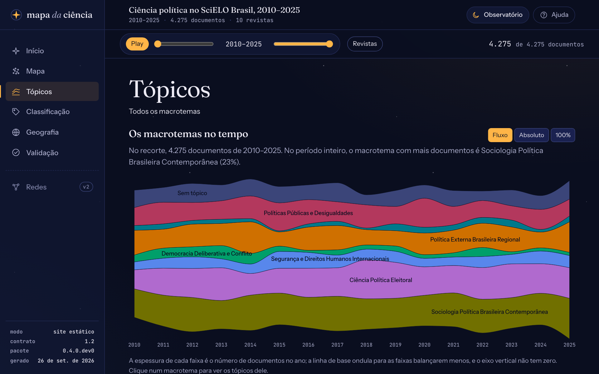
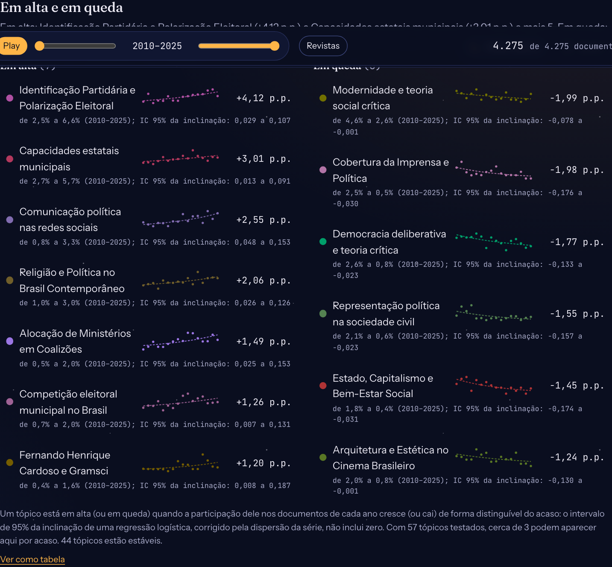
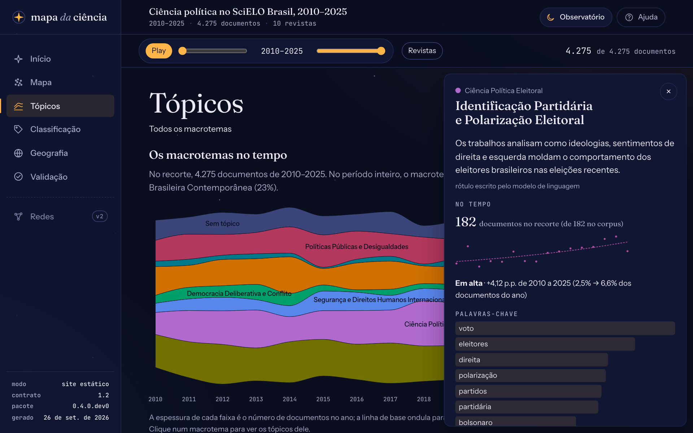

# Ler os tópicos no tempo

A vista **Tópicos** do painel mostra como os assuntos do corpus mudam ao longo dos anos: o fluxo dos macrotemas e dos tópicos, os que estão em alta e em queda, e a presença de cada assunto em cada revista. Esta página explica como ler cada parte. Para saber como os tópicos são construídos, veja [Como os tópicos são construídos](../explicacoes/topicos.md).

<figure markdown="span">
  { loading=lazy }
  <figcaption>O fluxo dos macrotemas no piloto de ciência política, de 2010 a 2025.</figcaption>
</figure>

## O fluxo

Cada faixa é um macrotema (a faixa "Sem tópico" reúne os documentos que não entraram em nenhum), e a espessura dela num ano é o número de documentos daquele macrotema no ano. Três modos, nos botões acima do gráfico:

- **Fluxo**: as faixas ondulam em torno de um eixo central, para balançarem menos de um ano para outro. É o melhor para ver a forma de cada faixa; o eixo vertical não tem zero.
- **Absoluto**: as faixas se empilham a partir do zero. A altura total é o número de documentos do ano, e dá para ler o eixo.
- **100%**: cada ano soma 100%, e a altura de cada faixa é a **participação** dela no ano. É o modo para comparar anos com volumes diferentes: se o corpus dobra de tamanho, uma faixa que também dobra fica igual.

Passe o mouse numa faixa para ver o número de documentos e a participação no ano. **Clique num macrotema** para abrir os tópicos dele; "Todos os macrotemas", no alto, volta.

## Em alta e em queda

A lista abaixo do fluxo mostra os tópicos cuja participação cresce ou cai de forma distinguível do acaso ao longo do período. Cada linha tem:

- a **sparkline**: a participação observada em cada ano (pontos) e a curva ajustada (tracejada);
- a **variação** em pontos percentuais, entre a participação ajustada no primeiro e no último ano do período. "+4,1 p.p." quer dizer que o tópico passou, por exemplo, de 2% para 6% dos documentos do ano;
- o **intervalo de 95%** da inclinação, em "Ver como tabela".

<figure markdown="span">
  { loading=lazy }
  <figcaption>No piloto, 7 tópicos em alta e 6 em queda. Identificação partidária e polarização é o que mais cresceu.</figcaption>
</figure>

Como ler com cuidado:

- A regra ([ADR 0009](../decisoes/0009-tendencia-dos-topicos.md)) marca um tópico só quando o intervalo de 95% da inclinação não inclui zero, corrigido pela dispersão da série. Mesmo assim, com dezenas de tópicos testados, cerca de 1 em 20 aparece por **acaso**. A nota abaixo da lista diz quantos seriam no recorte: trate a lista como pistas para ler os artigos, não como conclusões.
- Um **dossiê temático** faz um pico num ano só; a correção pela dispersão impede que ele vire tendência quando o pico cai no meio do período, mas não quando cai no primeiro ou no último ano da janela, e uma sequência de dossiês também pode virar. Confira a série antes de citar.
- A tendência é recalculada com o recorte. Com o **período** da barra, a regressão usa só aqueles anos; com menos de 5 anos com documentos, a lista pede um período maior.

## A gaveta de um tópico

Clique num tópico (no fluxo de um macrotema aberto ou nas listas) para abrir a gaveta:

<figure markdown="span">
  { loading=lazy }
  <figcaption>A gaveta do tópico que mais cresceu no piloto.</figcaption>
</figure>

- o **rótulo** e a **descrição**, e se foram escritos pelo modelo, tirados das palavras-chave ou corrigidos à mão no `rotulos.yaml`;
- a **série** do tópico no recorte, com a tendência no período escolhido;
- as **palavras-chave** que distinguem o tópico, com o peso de cada uma;
- as **revistas** em que ele aparece, no recorte;
- os **documentos representativos**, que abrem no Mapa;
- "Ver no mapa", que leva o recorte e o tópico para o Mapa, e "Filtrar pelo tópico", que põe o tópico no recorte.

++esc++ fecha a gaveta. O endereço guarda o tópico aberto: um link copiado abre na mesma gaveta.

## Por revista

Os pequenos múltiplos, no fim da vista, repetem o fluxo dos macrotemas para cada revista, na mesma escala de cores. Servem para ver o perfil de cada revista e para achar a que publica mais um assunto. Clique no nome de uma revista para pô-la no recorte.

## O recorte

A barra no alto (período, revistas e os chips de tópicos, busca, laço e lugares) vale para toda a vista. O fluxo ignora o próprio filtro de anos e de tópicos: mostra o período inteiro, com os anos fora do recorte velados, e as faixas dos tópicos escolhidos em destaque. O botão **Tocar** anima a linha do tempo ano a ano. O recorte vai junto quando você troca de vista pelo trilho: escolha uma UF na Geografia e volte aos Tópicos para ver os temas dos autores de lá.
